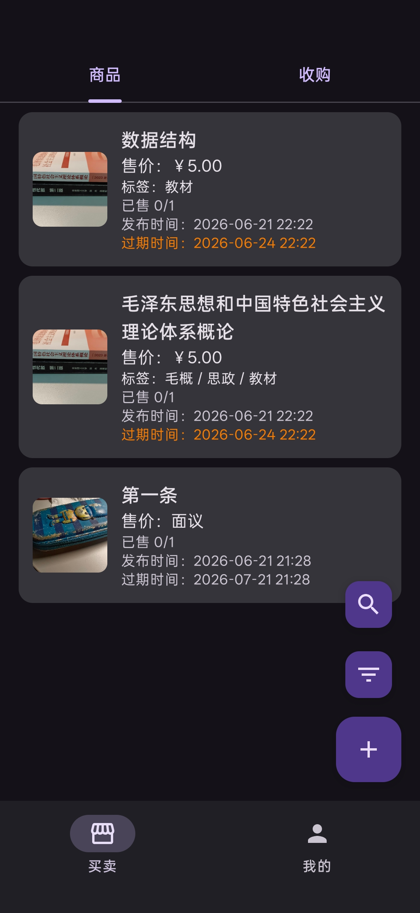
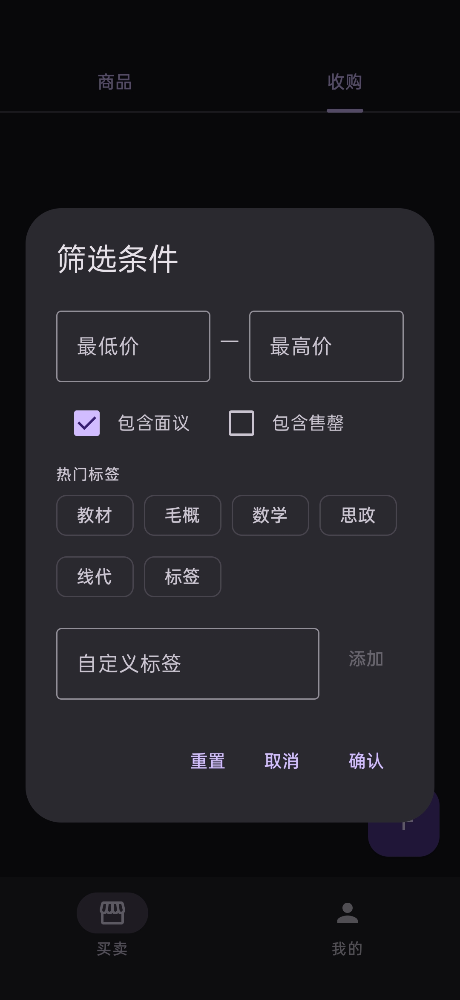
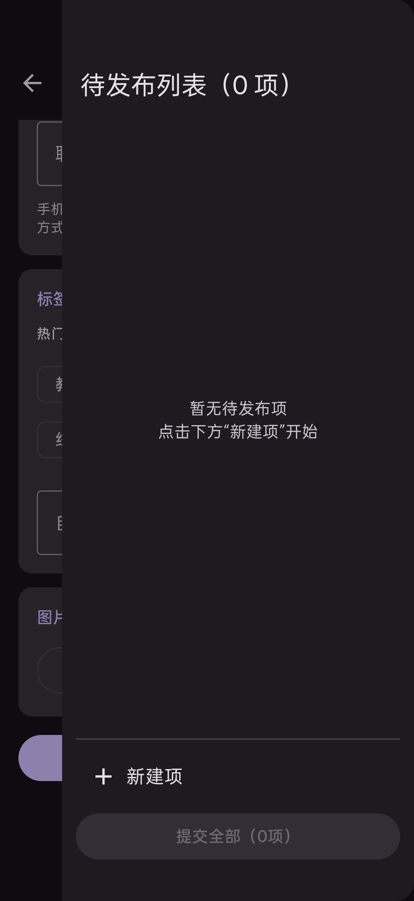
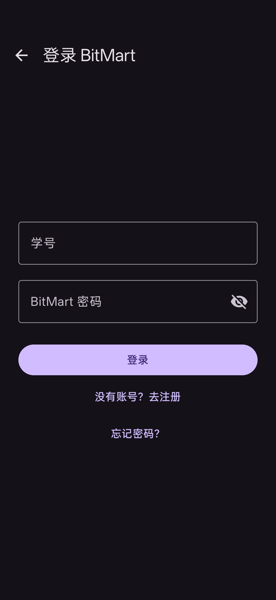
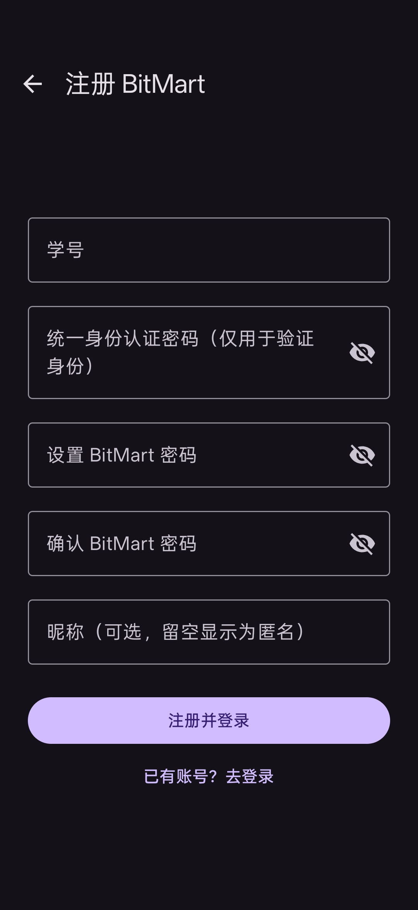
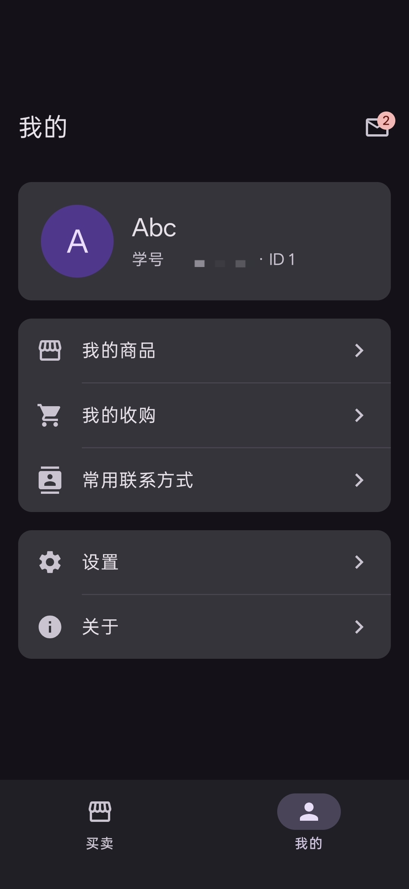
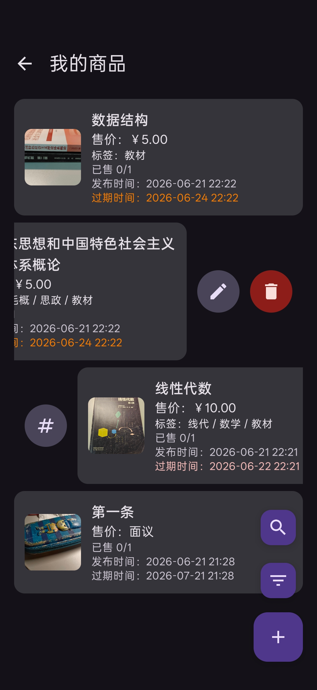

# BitMart：为北理工开发的跳蚤市场——《数据库原理与设计》《Android技术开发基础》课程设计

> 班级：<u>114514</u>	学号：<u>1919810</u>	姓名：<u>田所浩二</u>

[TOC]

## 运行与开发环境

### 后端

#### 运行环境

- JDK 21
- PostgreSQL 16，需启用扩展 `pg_trgm`；建议安装 `zhparser`，未安装时迁移脚本会降级为内置 `simple` 分词，中文搜索效果会下降
- 数据库默认 `jdbc:postgresql://localhost:5432/bitmart`，账号/密码 `bitmart/bitmart`
- 服务器监听端口默认 `8080`
- 无需 Docker
- 查询 ISBN 依赖环境变量 `BITMART_SHOWAPI_APP_KEY`，需要从 [ShowAPI](https://www.showapi.com/apiGateway/view/1626) 申请密钥（注册即有免费额度 50 次/天）

#### 部署方法

考虑到成本和项目完成度，我暂未在公网部署后端。

##### 初始化数据库

在 PostgreSQL 中创建用户 `bitmart` 及其拥有的数据库。

```sql
CREATE USER bitmart WITH PASSWORD 'bitmart';
CREATE DATABASE bitmart OWNER bitmart;
```

##### 配置环境变量

一共有以下环境变量可供配置，也可以修改 `application.conf` 配置文件。可以用环境变量覆盖配置中使用 `${?ENV}` 声明的项；未列出的配置项需要直接修改配置文件。

常用部署变量如下：

| 环境变量 | 默认值 | 说明 |
| --- | --- | --- |
| `PORT` | `8080` | 服务端监听端口 |
| `BITMART_DB_URL` | `jdbc:postgresql://localhost:5432/bitmart` | PostgreSQL JDBC 地址 |
| `BITMART_DB_USER` | `bitmart` | 数据库用户名 |
| `BITMART_DB_PASSWORD` | `bitmart` | 数据库密码 |
| `BITMART_DB_POOL_SIZE` | `10` | HikariCP 最大连接数 |
| `BITMART_STORAGE_ROOT` | `./storage` | 上传图片等 Blob 文件的本地保存目录 |
| `BITMART_BIT101_BASE_URL` | `https://bit101.flwfdd.xyz` | BIT 101 API 地址 |
| `BITMART_SHOWAPI_BASE_URL` | `https://route.showapi.com` | ShowAPI 网关地址 |
| `BITMART_SHOWAPI_APP_KEY` | 空 | ShowAPI ISBN 查询密钥 |

> [!CAUTION]
>
> `BITMART_SHOWAPI_APP_KEY` 未配置时将无法使用 ISBN 查询，但注册登录、发布编辑、列表、通知等核心功能不受影响。

以下变量通常不需要修改，主要用于调整业务规则和定时任务：

| 环境变量 | 默认值 | 说明 |
| --- | --- | --- |
| `BITMART_SESSION_TTL_DAYS` | `30` | 登录会话有效期，单位为天 |
| `BITMART_VERIFY_TICKET_TTL_MINUTES` | `15` | BIT101 验证票有效期，单位为分钟 |
| `BITMART_PASSWORD_MIN_LENGTH` | `8` | BitMart 账号密码最小长度 |
| `BITMART_PASSWORD_MIN_CHAR_CLASSES` | `2` | 密码至少包含的字符类别数 |
| `BITMART_EXPIRY_MIN_DAYS` | `1` | 发布项最短有效期，单位为天 |
| `BITMART_EXPIRY_MAX_DAYS` | `365` | 发布项最长有效期，单位为天 |
| `BITMART_EXPIRY_DEFAULT_DAYS` | `30` | 发布项默认有效期，单位为天 |
| `BITMART_TAG_MAX_PER_LISTING` | `8` | 单条发布最多标签数 |
| `BITMART_UPLOAD_MAX_FILE_BYTES` | `5242880` | 单个上传图片最大字节数，默认 5 MiB |
| `BITMART_EXPIRY_WARN_WINDOW_HOURS` | `24` | 临期提醒扫描窗口，单位为小时 |
| `BITMART_EXPIRY_WARN_INTERVAL_MINUTES` | `60` | 临期提醒任务执行间隔，单位为分钟 |

Windows PowerShell 示例：

```powershell
$env:BITMART_DB_URL = "jdbc:postgresql://localhost:5432/bitmart"
$env:BITMART_DB_USER = "bitmart"
$env:BITMART_DB_PASSWORD = "bitmart"
$env:BITMART_SHOWAPI_APP_KEY = "你的 ShowAPI appKey"
.\bin\bitmart-server.bat
```

Linux/MacOS 示例：

```bash
export BITMART_DB_URL='jdbc:postgresql://localhost:5432/bitmart'
export BITMART_DB_USER='bitmart'
export BITMART_DB_PASSWORD='bitmart'
export BITMART_SHOWAPI_APP_KEY='你的 ShowAPI appKey'
./bin/bitmart-server
```

##### 启动服务端

解压并进入 `bitmart-server-0.1.0/` 目录。

- Windows 系统执行 `.\bin\bitmart-server.bat`
- Linux/MacOS 执行 `./bin/bitmart-server`

##### 检查监听状态

可以访问 `http://localhost:8080/health` 检查状态，返回  `{"status":"ok"}` 即为成功。

#### 开发环境

- IntelliJ IDEA 2026.1.2
- JDK 21
- Kotlin 2.3.21
- Gradle 9.5.0
- Claude Code
- Codex

### Android 端

#### 运行环境

- Android 7.0 ~ 16 系统手机。未测试对平板电脑的兼容性。
- LLM 识图功能需要提供 OpenAI Compatible 协议的 API 接口和密钥。
- ISBN 扫码功能要求设备有摄像头并授权。

#### 部署方法

##### 开启 ADB 调试并连接电脑

**因为没有域名且受限于校园网环境，Android 端连接后端必须通过 `adb reverse tcp:8080 tcp:8080`。**

##### 安装 APK

安装 `bitmart-release.apk` 即可启动。

#### 开发环境

- Android Studio Panda 4 | 2025.3.4 Patch 1
- JDK 17
- Gradle 9.4.1
- AGP/Kotlin/KSP 9.2.1/2.3.21/2.3.9
- Claude Code

## App 需求分析

### 需求分析

目前我校跳蚤市场建立在 QQ 群上。在群里，卖家通常都是将商品拍照后附价格，而附文字描述较少，对于二手书尤甚。卖方这样很方便，但买方就比较麻烦，需要一张张图片找而不能搜索，而且很可能找到别人已经售出的商品。

因此我想开发这样一个跳蚤市场应用：卖方可以扫描书本条形码并填写售价、书况等信息，也可以对一本或多本书封面或书脊拍照后调用 LLM 批量添加，然后将信息上传到服务器数据库；对其他商品也同样可以提供拍照识别等功能，填写信息后上传到服务器。买方则可以搜索和筛选自己需要的商品，并获取卖方联系方式。相应地，买方也可以发布“收购”需求，等待卖方联系。

### 功能分解

- 账号
  - 调用 BIT101 API 转接统一身份认证系统进行身份验证后注册
  - 忘记/修改密码：身份认证后可以重置
  - 设置昵称
  - 修改密码
  - 注销账号
- 发布（出售/求购）
  - 填写名称、件数、单价、标签、描述、图片、联系方式、取货地点、过期时间
  - 书籍专项：ISBN、作者、出版社、版本；条形码扫描自动查书
  - 本地调用 LLM API，将图片压缩后发送识图
  - 草稿编辑、批量发布
- 公共列表
  - 商品/需求列表
  - 按时间排序、标签筛选、价格区间筛选、文字模糊搜索、是否展示售罄
  - 详情页显示卖家昵称、联系方式等详细信息（未登录不返回详情，以保护信息安全）
  - 不显示过期项
- 通知消息
  - 服务端通知：公告、临期提醒等
  - 支持通知拉取、未读计数与标记已读
- 我的
  - 我的发布列表（编辑、调整已售/收数量、删除）
  - 常用联系方式管理（本地存储）
  - 临期通知
- 设置
  - 多语言切换
  - 亮暗主题切换
  - LLM API 配置（本地存储）

### UI 设计与人机交互

参考 BIT 101 界面，采用经典 Material 3 主题。具体可见下面的图片和演示视频。

<center>
&emsp;
<br><br>
&emsp;
<br><br>
&emsp;
<br><br>
&emsp;
</center>

## 架构设计及技术实现方案

### 后端

```
bitmart-server/src/
├── main
│   ├── kotlin
│   │   └── cn
│   │       └── edu
│   │           └── bit
│   │               └── bitmart
│   │                   ├── AppComponents.kt
│   │                   ├── Application.kt
│   │                   ├── auth
│   │                   │   ├── AuthDto.kt
│   │                   │   ├── AuthResults.kt
│   │                   │   ├── AuthRoutes.kt
│   │                   │   ├── AuthService.kt
│   │                   │   ├── Bit101PasswordCipher.kt
│   │                   │   ├── OpaqueToken.kt
│   │                   │   ├── PasswordHasher.kt
│   │                   │   ├── SessionRepository.kt
│   │                   │   ├── TokenAuthenticator.kt
│   │                   │   └── VerifyTicketStore.kt
│   │                   ├── config
│   │                   │   ├── BitmartConfig.kt
│   │                   │   ├── ConfigReader.kt
│   │                   │   └── ConfigSections.kt
│   │                   ├── db
│   │                   │   ├── DatabaseFactory.kt
│   │                   │   └── Tables.kt
│   │                   ├── domain
│   │                   │   ├── DomainTypes.kt
│   │                   │   ├── Listing.kt
│   │                   │   ├── ListingValidator.kt
│   │                   │   ├── PasswordPolicy.kt
│   │                   │   ├── TagNormalizer.kt
│   │                   │   ├── User.kt
│   │                   │   └── ValidationResult.kt
│   │                   ├── external
│   │                   │   ├── Bit101Client.kt
│   │                   │   ├── Bit101Dto.kt
│   │                   │   ├── ShowApiClient.kt
│   │                   │   └── ShowApiDto.kt
│   │                   ├── job
│   │                   │   └── ExpiryWarningJob.kt
│   │                   ├── listing
│   │                   │   ├── BookMetaRepository.kt
│   │                   │   ├── ListingDto.kt
│   │                   │   ├── ListingInputs.kt
│   │                   │   ├── ListingRepository.kt
│   │                   │   ├── ListingRequestMapper.kt
│   │                   │   ├── ListingRoutes.kt
│   │                   │   ├── ListingService.kt
│   │                   │   ├── ListingServiceResults.kt
│   │                   │   └── TagRepository.kt
│   │                   ├── shared
│   │                   │   └── ApiError.kt
│   │                   ├── storage
│   │                   │   ├── BlobStorage.kt
│   │                   │   ├── ImageTypeDetector.kt
│   │                   │   ├── LocalDiskBlobStorage.kt
│   │                   │   ├── UploadRoutes.kt
│   │                   │   └── UploadService.kt
│   │                   └── user
│   │                       ├── MeRoutes.kt
│   │                       ├── NotificationRepository.kt
│   │                       ├── UserRepository.kt
│   │                       └── UserService.kt
│   └── resources
│       ├── application.conf
│       ├── db
│       │   └── migration
│       │       └── V1__baseline.sql
│       └── logback.xml
└── test
    └── kotlin
        └── cn
            └── edu
                └── bit
                    └── bitmart
                        ├── ApiPrefixContractTest.kt
                        ├── HealthRouteTest.kt
                        ├── ProjectConfig.kt
                        ├── auth
                        │   ├── AuthRoutesTest.kt
                        │   ├── AuthServiceTest.kt
                        │   ├── AuthTestSupport.kt
                        │   ├── Bit101PasswordCipherTest.kt
                        │   ├── OpaqueTokenTest.kt
                        │   ├── PasswordHasherTest.kt
                        │   └── VerifyTicketStoreTest.kt
                        ├── config
                        │   └── BitmartConfigTest.kt
                        ├── db
                        │   ├── EmbeddedPostgresSupport.kt
                        │   └── MigrationIntegrationTest.kt
                        ├── domain
                        │   ├── ListingValidatorTest.kt
                        │   ├── PasswordPolicyTest.kt
                        │   └── TagNormalizerTest.kt
                        ├── external
                        │   ├── Bit101ClientTest.kt
                        │   ├── MockHttpSupport.kt
                        │   └── ShowApiClientTest.kt
                        ├── job
                        │   └── ExpiryWarningJobTest.kt
                        ├── listing
                        │   └── ListingRoutesTest.kt
                        ├── storage
                        │   ├── ImageTypeDetectorTest.kt
                        │   ├── UploadRoutesTest.kt
                        │   └── UploadServiceTest.kt
                        └── user
                            └── MeRoutesTest.kt
```

- 整体架构
  - 按业务领域划分（`auth`/`listing`/`user`/`storage`），主要业务包按 Routes $\to$ Service $\to$ Repository 分层，`external` 封装外部 API 客户端
  - `domain` 提供数据模型与校验逻辑
  - `config` 读取 `application.conf` 配置
  
- Web 框架：Ktor 3.5 + Netty，添加插件 Authentication、CallId、CallLogging、ContentNegotiation、StatusPages（提供统一错误响应）

- 登录认证
  - 采用 Opaque Token 方案，登录签发随机令牌存数据库
  - Ktor Auth 插件校验 Bearer token
  - 密码用 Argon2id 哈希
  - 注册/重置密码前先经 BIT 101 验证，签发短时效 VerifyTicket，用 Caffeine 保存
  
- 数据库
  - PostgreSQL 16 + pg_trgm + zhparser（提供中文搜索）；`zhparser` 不可用时自动降级到 `simple` 分词
  - DDL 由 Flyway SQL 迁移管理（开发结束后压到了一个迁移文件里）
  - 应用层用 Exposed 库读写数据库
  - 用 HikariCP 库管理连接池
  - 用数据库触发器维护 `search_tsv` 全文检索列
  - 列表接口用 keyset 分页
  
- 外部 API 集成
  - `Bit101Client` 调用 BIT 101 API 转接学校的统一身份认证系统，验证学号密码（密码先本地加密）
  - `ShowApiClient` 调万维易源（ShowAPI） ISBN 查询 API，结果缓存至 `book_meta` 表，以减少 API 调用次数（学校交易的书籍多为课程相关，大多重复）
  
- 文件存储：直接作为文件存在磁盘，图片上传经 MIME 白名单校验，客户端可通过 `/static` 路径访问

- `job` 定时任务：`ExpiryWarningJob` 协程定时扫描即将过期的项，创建站内通知（`NotificationRepository`）

- JSON 解析：Exposed JSONB
  - 通知
  - Show API 响应解析

- 日志：Logback

- 测试
  - Kotest + JUnit 5
  - 用 zonky embedded-postgres 调用 PG
  - Ktor TestHost 路由级测试
  - Ktor MockEngine 模拟客户端
  
- 主要数据库结构：

  ```sql
  CREATE TABLE app_user (
      id            BIGINT GENERATED ALWAYS AS IDENTITY PRIMARY KEY,
      student_id    VARCHAR(20)  NOT NULL,                  -- 学号（唯一性见下方部分唯一索引）
      password_hash TEXT         NOT NULL,                  -- Argon2id
      nickname      VARCHAR(32)  NULL,                      -- 空 → 展示为"匿名"
      role          SMALLINT     NOT NULL DEFAULT 0,        -- 0 普通 / 1 管理员
      status        SMALLINT     NOT NULL DEFAULT 0,        -- 0 正常 / 1 封禁
      created_at    TIMESTAMPTZ  NOT NULL DEFAULT now(),
      deleted_at    TIMESTAMPTZ  NULL                       -- 注销：仅打标
  );
  
  CREATE TABLE notification (
      id         BIGINT GENERATED ALWAYS AS IDENTITY PRIMARY KEY,
      user_id    BIGINT      NULL REFERENCES app_user(id),  -- NULL 表示全员公告
      category   SMALLINT    NOT NULL,                      -- 0 ANNOUNCEMENT / 1 EXPIRY_WARN / ...
      title      VARCHAR(120) NOT NULL,
      body       TEXT        NOT NULL,
      payload    JSONB       NULL,                          -- 跳转 listingId 等
      read_at    TIMESTAMPTZ NULL,
      created_at TIMESTAMPTZ NOT NULL DEFAULT now()
  );
  
  CREATE TABLE listing (
      id              BIGINT GENERATED ALWAYS AS IDENTITY PRIMARY KEY,
      type            SMALLINT      NOT NULL,                 -- 0 SELL / 1 BUY
      category        SMALLINT      NOT NULL,                 -- 0 GENERAL / 1 BOOK
      user_id         BIGINT        NOT NULL REFERENCES app_user(id),
      title           TEXT          NOT NULL,
      description     TEXT          NOT NULL DEFAULT '',
      unit_price      NUMERIC(10,2) NULL,                     -- NULL = 面议/带价联系
      original_price  NUMERIC(10,2) NULL,                     -- 原价/划线价，NULL = 不展示
      quantity_total  INT           NOT NULL CHECK (quantity_total >= 1),
      quantity_sold   INT           NOT NULL DEFAULT 0
                      CHECK (quantity_sold BETWEEN 0 AND quantity_total),
      pickup_location TEXT          NULL,
      contact         JSONB         NOT NULL,                 -- [{channel, value}, ...]，应用层校验非空
      expires_at      TIMESTAMPTZ   NOT NULL,
      created_at      TIMESTAMPTZ   NOT NULL DEFAULT now(),
      updated_at      TIMESTAMPTZ   NOT NULL DEFAULT now(),
      deleted_at      TIMESTAMPTZ   NULL,                     -- 软删除
      search_tsv      TSVECTOR,                               -- 触发器维护
      source          SMALLINT      NOT NULL DEFAULT 0        -- 0 USER / 1 NAPCAT_BOT（预留）
  );
  
  CREATE TABLE listing_book (
      listing_id BIGINT PRIMARY KEY REFERENCES listing(id) ON DELETE CASCADE,
      isbn       VARCHAR(20) NULL,
      title      TEXT NULL,
      authors    TEXT NULL,
      publisher  TEXT NULL,
      edition    TEXT NULL
  );
  
  CREATE TABLE listing_image (
      id         BIGINT GENERATED ALWAYS AS IDENTITY PRIMARY KEY,
      listing_id BIGINT   NOT NULL REFERENCES listing(id) ON DELETE CASCADE,
      blob_key   TEXT     NOT NULL,                          -- 由 BlobStorage 解释
      ord        SMALLINT NOT NULL,
      width      INT      NULL,
      height     INT      NULL,
      UNIQUE(listing_id, ord)
  );
  
  CREATE TABLE tag (
      id          BIGINT GENERATED ALWAYS AS IDENTITY PRIMARY KEY,
      name        VARCHAR(20) NOT NULL UNIQUE,               -- 归一化（小写、去空白）
      usage_count INT         NOT NULL DEFAULT 0             -- 热门标签建议
  );
  
  CREATE TABLE listing_tag (
      listing_id BIGINT NOT NULL REFERENCES listing(id) ON DELETE CASCADE,
      tag_id     BIGINT NOT NULL REFERENCES tag(id),
      PRIMARY KEY (listing_id, tag_id)
  );
  
  -- 服务端缓存的 ISBN 元数据（不可变事实，命中即免调 ShowAPI）。
  CREATE TABLE book_meta (
      isbn       VARCHAR(20) PRIMARY KEY,
      title      TEXT NULL,
      authors    TEXT NULL,
      publisher  TEXT NULL,
      edition    TEXT NULL,
      raw        JSONB       NOT NULL,                        -- ShowAPI 原始返回
      fetched_at TIMESTAMPTZ NOT NULL DEFAULT now()
  );
  ```

### Android 端

```
bitmart-android/app/src/
├── main
│   ├── AndroidManifest.xml
│   ├── kotlin
│   │   └── cn
│   │       └── edu
│   │           └── bit
│   │               └── bitmart
│   │                   ├── BitMartApplication.kt
│   │                   ├── BitMartNavHost.kt
│   │                   ├── BitMartShell.kt
│   │                   ├── MainActivity.kt
│   │                   ├── core
│   │                   │   ├── data
│   │                   │   │   ├── local
│   │                   │   │   │   ├── ContactPrefsStore.kt
│   │                   │   │   │   ├── LanguagePrefsStore.kt
│   │                   │   │   │   ├── LlmConfigStore.kt
│   │                   │   │   │   ├── ThemePrefsStore.kt
│   │                   │   │   │   └── TokenStore.kt
│   │                   │   │   ├── remote
│   │                   │   │   │   ├── ApiResponseMapper.kt
│   │                   │   │   │   ├── BitMartApi.kt
│   │                   │   │   │   └── Dtos.kt
│   │                   │   │   └── repository
│   │                   │   │       ├── AuthRepositoryImpl.kt
│   │                   │   │       ├── ListingRepositoryImpl.kt
│   │                   │   │       └── ProfileRepositoryImpl.kt
│   │                   │   ├── designsystem
│   │                   │   │   └── Theme.kt
│   │                   │   ├── di
│   │                   │   │   └── AppModule.kt
│   │                   │   ├── domain
│   │                   │   │   ├── DomainResult.kt
│   │                   │   │   ├── model
│   │                   │   │   │   ├── AppLanguage.kt
│   │                   │   │   │   ├── Models.kt
│   │                   │   │   │   ├── PublishConfig.kt
│   │                   │   │   │   └── ThemeMode.kt
│   │                   │   │   └── repository
│   │                   │   │       ├── AuthRepository.kt
│   │                   │   │       ├── ListingRepository.kt
│   │                   │   │       └── ProfileRepository.kt
│   │                   │   └── ui
│   │                   │       ├── AdjustQuantityDialog.kt
│   │                   │       ├── AppLocale.kt
│   │                   │       ├── ImageViewer.kt
│   │                   │       ├── ListingCard.kt
│   │                   │       ├── ListingFilterDialog.kt
│   │                   │       ├── ListingTimeInfo.kt
│   │                   │       ├── ListingTypeLabels.kt
│   │                   │       ├── MediaUrls.kt
│   │                   │       ├── OwnedListingRow.kt
│   │                   │       ├── PasswordField.kt
│   │                   │       ├── SearchDialog.kt
│   │                   │       ├── SwipeRevealRow.kt
│   │                   │       ├── TimeFormats.kt
│   │                   │       └── UiText.kt
│   │                   ├── feature
│   │                   │   ├── about
│   │                   │   │   └── AboutScreen.kt
│   │                   │   ├── auth
│   │                   │   │   ├── AppAuthViewModel.kt
│   │                   │   │   ├── AuthScreen.kt
│   │                   │   │   └── AuthViewModel.kt
│   │                   │   ├── bookscan
│   │                   │   │   └── BookScanScreen.kt
│   │                   │   ├── detail
│   │                   │   │   ├── ListingDetailScreen.kt
│   │                   │   │   └── ListingDetailViewModel.kt
│   │                   │   ├── feed
│   │                   │   │   └── ListingFeedScreen.kt
│   │                   │   ├── listing
│   │                   │   │   └── ListingListViewModel.kt
│   │                   │   ├── notifications
│   │                   │   │   ├── ExpiryWarningPayload.kt
│   │                   │   │   ├── NotificationsScreen.kt
│   │                   │   │   └── NotificationsViewModel.kt
│   │                   │   ├── profile
│   │                   │   │   ├── ContactsScreen.kt
│   │                   │   │   ├── ContactsViewModel.kt
│   │                   │   │   ├── MyListingsScreen.kt
│   │                   │   │   ├── ProfileScreen.kt
│   │                   │   │   └── ProfileViewModel.kt
│   │                   │   ├── publish
│   │                   │   │   ├── PublishScreen.kt
│   │                   │   │   └── PublishViewModel.kt
│   │                   │   ├── settings
│   │                   │   │   ├── AccountSettingsScreen.kt
│   │                   │   │   ├── AccountSettingsViewModel.kt
│   │                   │   │   ├── ChangePasswordScreen.kt
│   │                   │   │   ├── LanguageViewModel.kt
│   │                   │   │   ├── LlmSettingsScreen.kt
│   │                   │   │   ├── LlmSettingsViewModel.kt
│   │                   │   │   ├── SettingsScreen.kt
│   │                   │   │   └── ThemeViewModel.kt
│   │                   │   └── trade
│   │                   │       └── TradeScreen.kt
│   │                   └── llm
│   │                       ├── LlmClient.kt
│   │                       ├── LlmConfig.kt
│   │                       ├── LlmRecognition.kt
│   │                       ├── OpenAiCompatibleLlmClient.kt
│   │                       └── Prompts.kt
│   └── res
│       ├── values
│       │   ├── strings.xml
│       │   └── themes.xml
│       ├── values-zh
│       │   └── strings.xml
│       └── xml
│           └── file_paths.xml
└── test
    └── kotlin
        └── cn
            └── edu
                └── bit
                    └── bitmart
                        ├── AuthRouteArgumentsTest.kt
                        ├── RoutesNavTest.kt
                        ├── core
                        │   ├── data
                        │   │   ├── AuthRepositoryImplTest.kt
                        │   │   ├── BitMartApiTimeoutTest.kt
                        │   │   ├── DataStoreLanguagePrefsStoreTest.kt
                        │   │   ├── FakeContactPrefsStore.kt
                        │   │   ├── FakeLanguagePrefsStore.kt
                        │   │   ├── FakeLlmConfigStore.kt
                        │   │   ├── FakeThemePrefsStore.kt
                        │   │   ├── FakeTokenStore.kt
                        │   │   ├── InMemoryPreferencesDataStore.kt
                        │   │   ├── ListingRepositoryBatchTest.kt
                        │   │   ├── ListingRepositoryImplTest.kt
                        │   │   ├── LlmConfigStoreTest.kt
                        │   │   ├── ProfileRepositoryImplTest.kt
                        │   │   ├── TestApiSupport.kt
                        │   │   ├── ThemePrefsStoreTest.kt
                        │   │   └── remote
                        │   │       └── ApiResponseMapperTest.kt
                        │   ├── domain
                        │   │   └── model
                        │   │       ├── AppLanguageTest.kt
                        │   │       ├── ListingTypeTest.kt
                        │   │       └── ThemeModeTest.kt
                        │   └── ui
                        │       ├── ErrorCodeResTest.kt
                        │       ├── TimeFormatsTest.kt
                        │       └── UiTextTest.kt
                        ├── feature
                        │   ├── auth
                        │   │   ├── AppAuthViewModelTest.kt
                        │   │   └── AuthViewModelTest.kt
                        │   ├── detail
                        │   │   └── ListingDetailViewModelTest.kt
                        │   ├── edit
                        │   ├── feed
                        │   ├── listing
                        │   │   └── ListingListViewModelTest.kt
                        │   ├── notifications
                        │   │   ├── ExpiryWarningPayloadTest.kt
                        │   │   └── NotificationsViewModelTest.kt
                        │   ├── profile
                        │   │   ├── ContactsViewModelTest.kt
                        │   │   └── ProfileViewModelTest.kt
                        │   ├── publish
                        │   │   └── PublishViewModelTest.kt
                        │   └── settings
                        │       ├── AccountSettingsViewModelTest.kt
                        │       ├── LanguageViewModelTest.kt
                        │       ├── LlmSettingsViewModelTest.kt
                        │       └── ThemeViewModelTest.kt
                        ├── i18n
                        │   └── StringsParityTest.kt
                        └── llm
                            ├── OpenAiCompatibleLlmClientLangTest.kt
                            ├── OpenAiCompatibleLlmClientTest.kt
                            └── PromptsTest.kt
```

- 整体架构：**采用 clean architecture**
  - domain
  - data（Repository 实现 + 远程/本地数据源）
  - feature（Compose UI + ViewModel）；
  - 用 Hilt 库进行依赖注入
- 网络层
  - Ktor Client 3.5（OkHttp 引擎），`BitMartApi` 封装后端调用
  - `ApiResponseMapper` 统一将 HTTP 响应映射为 `DomainResult<T>(sealed class)`；Token 由 `TokenStore` 持久化，请求时自动附带
- 本地存储：DataStore Preferences 存 token 和主题、语言、LLM 配置、常用联系方式等本地设置
- LLM 识图
  - 本地调用用户配置的 API（key 仅存本地 DataStore）
  - 用 OpenAI Compatible 协议的 `response_format` 约束 JSON 输出，配合提示词工程兜底（防止~~反代的~~ API 不支持 `response_format` ~~我用的就是反代的~~）
  - 识别结果可再次统一或分别编辑
- 条形码扫描：CameraX + ML Kit Barcode，扫到 ISBN 后发送给后端查询书籍信息
- 站内通知：进入“我的”页面时从服务器拉取
- UI
  - Jetpack Compose + Material 3
  - 支持亮/暗/跟随系统主题（ThemePrefsStore + Theme.kt）
  - 多语言切换（AppLocale + LanguagePrefsStore，ProvideAppLocale CompositionLocal）
  - `collectAsStateWithLifecycle` 订阅状态
  - Coil 显示图片
- 测试
  - JUnit 4 + kotlinx-coroutines-test + Turbine
  - Ktor MockEngine 模拟后端与 LLM API
  - InMemory Preferences DataStore 验证本地存储

## 技术亮点、技术难点和解决方案

### 身份验证

利用 BIT 101 的 API 转接学校的统一身份认证系统。通过这种办法，应当可以避免校外人员混入，理论上比 QQ 群更加安全。

### 识图功能

最开始的设想是采用 OCR + LLM 整理，但考虑到实际中直接 OCR 容易将多本书的文本混杂在一起，决定改为直接用 LLM 识图，代价是对 LLM API 的要求变高（需要支持多模态）。出于成本，没有在服务端提供 LLM 功能，而是由用户自行接入。

实测准确率可以接受，具体取决于模型质量。

### 扫码功能

引入 ShowAPI 的 ISBN 查询 API，并通过数据库将查询结果缓存，以减少重复查询和 API 消耗。Android 端可以扫书本条形码提取 ISBN，据此向服务器查询书籍信息，免于手动录入。

### 大量使用 Agent 代码工具

项目超过 95% 的代码由采用 Claude Opus 4.7/4.8 模型的 Claude Code 完成，我仅在初期 demo 阶段、调试 LLM 功能、调试 UI 以及进行简单修改时手工修改过代码。

> 我还少量使用了**可能**基于 GPT-5.5 的 Codex。我在使用过程中发现 OpenAI 官方掺水 2024 年 6 月的老旧模型，可能是因为即将发布 GPT-5.6。

最基本的问题是成本问题，直接订阅 Claude 是我这个穷学生承担不起的。多亏我的挚友为我提供了极低成本的中转中转中转站资源，使我得以燃烧 token。当然，也是有代价的，中转中转中转站的 Claude 有一部分来自 Kiro 等编辑器反代，导致 token 不纯，有一小段时间不管发甚么都跟我说法语，当时出 Fable 5 的时候还用 DeepSeek 掺水（而且水分比例相当高）。中转中转中转站当然也有不稳定问题，我在日志上见识了 500、502、504 等各种 HTTP 错误码。

在开始写代码前，我与 CC 就架构和需求问题进行了长达多日的（其实是因为同时在忙别的事情）讨论，写成文档形式。我本以为像这样先把需求和架构明确为文档，后续直接指派 agent 根据文档实现，可以有效抑制 agent 的瞎写行为；然而事实上还是与文档出现了不少偏离。我不得不手工测试效果并人工干预。

为了约束其行为，我引入了 superpowers 技能（所谓的“skill”），并要求其对于任何代码修改都调用按照“impl-test-review”的流程进行循环，直至没有问题。然而，实操中出现了包括如不遵守工作流、调用子代理失败等问题。这主要是因为我对 CC 本身不熟悉（例如不知道 `CLAUDE.md` 只有在开新对话时才注入），其次是因为 CC 本身的 bug。

CC 最重大的 bug 是这个 auto mode 老是出问题。其设想是好的：当 agent 需要编辑文件或调用命令时，由特定规则或另一个模型评估其命令的危险程度，存在风险的交由用户决断。实操中，不知道是有甚么 bug，一切编辑和命令行都给我决定，然后还回头告诉 agent 说他的命令被 auto mode block 了，污染上下文。我不得不开 `--dangerously-skip-permissions`，但开这个模式本身都经历了一些挫折——这个模式只对新对话生效，不在该模式下创建的对话仍不允许跳过权限审核。其他的诸如输入框 cursor 消失、列表不显示 session 这样的小 bug 我都不说了。该说到底是 vibe coding 产物吗？可隔壁 Codex 的体验感好得多。

## 改进方向

受限于课业压力和其他事务，我没办法将该项目做到尽善尽美。下面是我预想完成但在提交项目前并未做到的改进方向。

### 容器化

配置 `docker-compose.yml`，使配置 PostgresQL 数据库的过程自动化。

### MinIO

目前上传的图片直接作为文件保存，很不优雅。应当引入 MinIO 对象存储。

### NapCat + LLM

这样一个跳蚤市场应用在初期的最大问题就是“用户少 $\to$ 商品少 $\to$ 用户少 $\to\cdots$”的恶性循环。如果跳蚤市场管理员同意，通过 NapCat 框架接入跳蚤市场 QQ 群，通过 LLM 分析群内消息，自动化提交到数据库，将可以极大丰富商品数量，从而打破循环，实现从 QQ 群到 BitMart 的数据和用户迁移。

我已经在我的内网服务器上部署了 NapCat + AstrBot 的 QQ 聊天机器人，用以验证 NapCat 的功能和 LLM 对 QQ 消息的理解。经过一个多月的使用，我认为技术上这一方案这是可行的，可惜时间不允许。

### 通知

现在的“通知”功能局限在应用内。期望能够实现 FCM 或 SSE 通知。

### 管理员

管理员应当可以删除普通用户发布的买卖需求，封禁用户以及发布公告。

### 公网部署

租赁域名或内网穿透。考虑到当前项目完成度有限，我暂时没有这么做。

## 简要开发过程

~~很多时候是发现了甚么问题修甚么问题，没问题就用 AI 找问题~~

因为有一百多条 commits（详见[GitHub 仓库](https://github.com/Joyce-Peng-GitHub/BitMart)），所以这里只大概总结一下各个阶段。

### 2026/05

思考创意，分析需求，写 demo 验证，与 Claude Code 讨论架构，写成文档。

### 2026/06/02 ~ 2026/06/03

用 CC 快速完成核心功能开发。

### 2026/06/05 ~ 2026/06/08

主要进行需求对齐与修复，因为 CC 在之前的快速开发过程中与设计发生了不少的偏移，即便核心功能没问题。

包括

- 优化数量调整
- 实现“常用联系方式”
- 优化 UI
- 实现 ISBN 查询
- 实现标签筛选和搜索功能
- 优化日志记录等

### 2026/06/11 ~ 2026/06/19

完善交互体验，包括：

- 加入相机/相册入口，实现图片缩略图、全屏图片查看
- 优化过期通知，优化过期时间设置
- 重构和优化详情页、发布页、个人页
- 实现下拉刷新功能
- 优化 LLM 识别
- 优化错误提示
- 优化商品显示 UI、账号设置 UI
- 优化标签筛选
- 实现主题切换、多语言切换

### 2026/06/19 ~ 2026/06/21

检查安全性并进行收尾工作。

- 修复账号、密码、注册、认证跳转、并发售出数量、未知枚举、HTTP 超时等问题
- 完善校验错误、标题/描述长度限制
- 必填字段显示星号标记
- 压缩 Flyway 迁移
- 清理未使用的依赖
- 优化后端日志和报错消息
- 配置 release APK
- 编写文档

## 感悟

### 关于代码量

其实我本以为一万到五万行代码很难凑，得很复杂的项目才能达到这个数量级；但没想到整套功能做下来，尽管我还有一些原本设想的功能（例如管理员相关的功能、NapCat 爬消息等）没有实现，代码量就已经达到了两万多行。使用 Ktor 框架的情况下，仅仅实现这样一个 CRUD 软件的复杂性仍然比我预想的要更高，而且设计数据库也想了不少时间，算是改变了我对这类 CRUD 软件的看法。

```
PS E:\Projects\BitMart> tokei .\bitmart-android\
===============================================================================
 Language            Files        Lines         Code     Comments       Blanks
===============================================================================
 Batch                   1           94           73            0           21
 Kotlin                116        14451        11831         1218         1402
 Shell                   1          251          106          119           26
 TOML                    1           73           62            0           11
 XML                     5          645          597            1           47
===============================================================================
 Total                 124        15514        12669         1338         1507
===============================================================================

PS E:\Projects\BitMart> tokei .\bitmart-server\
===============================================================================
 Language            Files        Lines         Code     Comments       Blanks
===============================================================================
 Batch                   1           82           64            0           18
 Kotlin                 75         7224         5754          662          808
 Shell                   1          248          103          119           26
 SQL                     1          198          144           37           17
 TOML                    1           69           52            8            9
 XML                     1           42           34            2            6
===============================================================================
 Total                  80         7863         6151          828          884
===============================================================================
```

### 关于 AI

经过业余参加算法竞赛多年（尽管水平很差），我也算是半个手写代码的非遗传承人[^1]，这大概是我第一次尝试在项目中几乎全部代码都由 AI 生成。在本项目的正式开发过程中，我几乎没有手写代码（详见“大量使用 Agent 代码工具”部分），只对 CC 发布命令后，待其编辑完成，查看效果，然后提出进一步意见，或要求它 commit 然后开下一轮。AI 代码效果很好，这在我意料之中。我认为现在的 LLM 技术已经极大威胁一般程序员的饭碗了。涉及 Android 的尚且如此，用网页做前端的就更不必说了（不少 agent 工具都提供了直接操作浏览器的 MCP）。Android 好像也有类似的 MCP，但我懒得折腾了。

经过本项目的开发，我现在认为，现有 LLM 技术足以让**没有相关技术经验但有编程经验**的人可以独立进行前后端应用的快速开发。例如，我有以算法竞赛为主的**编程经验**，但对 Android 及后端开发缺乏**业务经验**。这使我可以看懂代码、用计算机的逻辑描述我的需求，但不知道如何用合适的方式翻译为业务代码。Agent 技术算是可以强行补上这一缺点。理想的“自然语言编程”大概就是这样罢？人只需要用有逻辑的自然语言描述需求，由“编译器”（现在是 coding agent）翻译为机器代码。前几年我看有人炒作“低代码”“零代码”，当时我就觉得这个东西不可能大范围推广，现在看来果然如此，但 agent 的影响力似乎比“低/零代码”大得多。

之前在爪哇课的项目中，我独立找到了 Netty 库的 bug[^2]——这是我当时比较得意的一件事，并以此佐证当时我觉得“现阶段的 AI 还不足以替代人类”的观点。随着近段时间我对 agent 工具的使用，我已经改变这个看法。我确信现在的 agent 工具重复我当年找到 Netty 库的 bug 的历程是毫不费力的，而且比我更快、更高效~~、更烧钱~~。例如，我曾用 Codex 辅助修复 AstrBot 的问题，它可以直接查询相关文档和 GitHub 上的 issue，改本地服务器的 Python 代码。我有点记不清了，但我记得某次让 agent 检查某个软件的问题时，它甚至最后直接把源码下载下来分析。

这种方便不是没有代价的。最首要的代价和阻碍就是金钱，也就是成本问题。在项目开发的整个过程中，我使用的 Claude Opus 4.8 大概烧了 **\$2900** 的 token——当然，我并没有实际花钱（我显然也出不起这笔钱），这是把我烧的 token 换算到 Claude 官方 API 价格计算出的开销。**这笔开销远高于直接外包定制的价格[^3]。**这可能暗示，只要人力的成本小于烧 token 的成本，程序员或许就可以免于完全失业（？），但我估计大厂里的裁员、工资下降、工作量增加——总而言之，“降本增效”——是不可避免的，因为老板可能按用 AI 的效率发布任务却不给 API。听说现在已经有人是自己花钱买上班用的 token 了。

其次，我并不是说不会编程也能写，项目的复杂度决定了它还是有门槛的。最起码地，开发者要能理解程序运行的逻辑，并用这样的逻辑清晰描述自己的需求——这并不是人人都能做到的事。拥有这样的逻辑，一个充分不必要的条件是有一定的编程经验。而且，开发者需要学习相关的专有名词，例如 Android UI 中的 FAB、scaffold、navigation bar、tab、toast 等。

我在开发过程中并不能不干预 CC 的行为，我必须观察它的思路，及时纠正错误，并给出方向上的指引。实践证明，即使把需求和架构以详细的文档清晰呈现，CC 在实现过程中仍然会**偏离意图**；即便我安装了 superpowers 技能并且配置了我自己的“impl-test-review”工作流，CC 仍然容易**顾此失彼**，例如在实现 i18n 时，CC 把我原有的报错 toast 消息全改成了相同的。这种现象在开新一轮时以及项目代码量超过一万五后更加明显。CC 自己的 memory 系统不能很好地解决这个问题，因为很多时候它改了代码却并**没有同步更新记忆**。也许应当要求 CC 在维护代码的同时维护描述代码的文档并人工检查，这样新一轮对话只需直接读取文档。下次试试这个想法。

期待国产开源模型特别是智谱和 DeepSeek 早日追上 OpenAI 和 A÷ 脚步，这两家国产是我比较看好的，前者能力强，后者性价比高。

## 参考文献

[^1]:  by 南京大学[蒋岩炎](https://jyywiki.cn/)。
[^2]: [HyPerFS 项目的 README](https://github.com/Joyce-Peng-GitHub/HyPerFS#%E9%81%87%E5%88%B0%E7%9A%84%E6%8A%80%E6%9C%AF%E9%9A%BE%E7%82%B9%E5%92%8C%E8%A7%A3%E5%86%B3%E6%96%B9%E6%A1%88)。
[^3]: 
