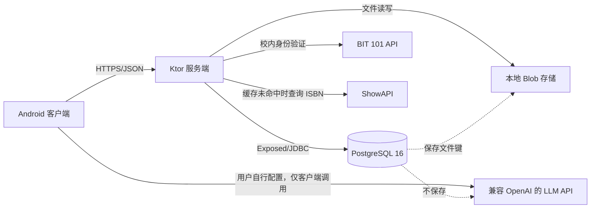
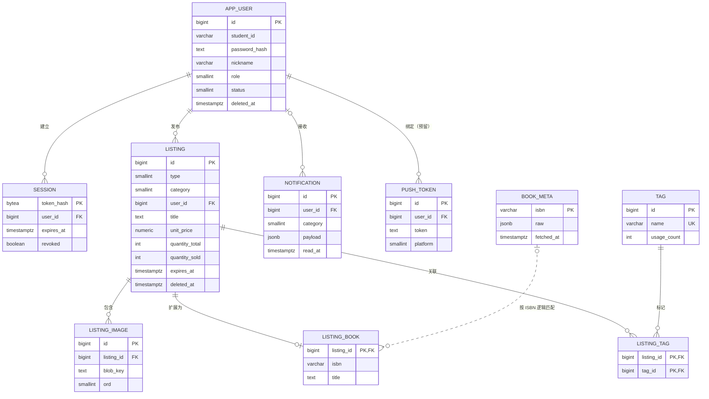

# BitMart 数据库设计

> 班级：<u>114514</u>	学号：<u>1919810</u>	姓名：<u>田所浩二</u>

> [!IMPORTANT]
>
> 本文档仅包括**数据库**相关内容，项目总文档详见 README。

## 设计概述

BitMart 采用 PostgreSQL 16 作为服务端关系数据库，以用户、发布和通知为核心组织数据。出售和求购共享 `listing` 主表，通过类型字段区分；普通商品和书籍共享核心字段，书籍特有字段拆分到一对零或一的扩展表。图片文件存放在数据库外部，数据库只维护文件键和顺序。

数据库结构由 Flyway 基线迁移统一创建，Kotlin 服务端通过 Exposed 访问数据，HikariCP 管理连接。搜索使用 PostgreSQL 全文检索与 `pg_trgm` 模糊匹配，列表和通知采用 keyset 游标分页。

## 设计原则

1. **统一核心模型**：出售和求购、普通商品和书籍尽可能复用稳定字段，减少重复表和重复查询逻辑。
2. **关系完整性优先**：实体使用主键标识，关联使用外键，发布的从属数据在物理删除时级联清理。
3. **历史可追溯**：用户和发布采用软删除，注销、下架和过期不立即丢失业务记录。
4. **敏感数据最小化**：密码和会话令牌均不保存明文，公开查询不返回联系方式。
5. **事务边界完整**：一次业务操作涉及的多表更新在同一事务中提交。
6. **面向查询设计**：围绕公开列表、我的发布、会话认证、通知和搜索建立索引。
7. **明确预留边界**：`push_token` 和机器人发布来源属于结构预留；管理员对发布的编辑/删除授权已在服务层部分实现，但封禁、公告发布和管理入口尚未形成完整功能。

## 数据库边界与数据流



- PostgreSQL 保存结构化业务数据、JSONB 半结构化字段和图片文件键。
- Blob 存储保存图片二进制内容。
- BIT 101 验证票为短时内存数据，不进入 PostgreSQL。
- Android 的主题、语言、常用联系方式、LLM 配置和未发布草稿不进入服务端数据库。

## 概念结构设计

### 实体及联系



### 基数说明

- 用户与会话、发布、推送令牌均为一对多。
- 用户与通知为可选的一对多：个人通知关联一个用户，全员公告的 `user_id` 为空。
- 发布与图片为一对多。
- 发布与标签通过 `listing_tag` 形成多对多。
- 发布与书籍扩展为一对零或一；`listing_book.listing_id` 同时作为主键和外键，保证同一发布至多一条书籍记录。
- `book_meta` 是独立 ISBN 缓存，`listing_book` 是发布快照。两者仅按 ISBN 逻辑关联，不设置外键。

## 逻辑结构设计

### 关系模式

下划线属性为主键，`FK` 表示外键，`UK` 表示唯一键。

- `APP_USER(` <u>`id`</u> `, student_id[UK-条件], password_hash, nickname, role, status, created_at, deleted_at)`
- `SESSION(` <u>`token_hash`</u> `, user_id[FK], created_at, last_used_at, expires_at, user_agent, revoked)`
- `NOTIFICATION(` <u>`id`</u> `, user_id[FK,可空], category, title, body, payload, read_at, created_at)`
- `PUSH_TOKEN(` <u>`id`</u> `, user_id[FK], token, platform, created_at, updated_at, UNIQUE(user_id, token))`
- `LISTING(` <u>`id`</u> `, type, category, user_id[FK], title, description, unit_price, original_price, quantity_total, quantity_sold, pickup_location, contact, expires_at, created_at, updated_at, deleted_at, search_tsv, source)`
- `LISTING_IMAGE(` <u>`id`</u> `, listing_id[FK], blob_key, ord, width, height, UNIQUE(listing_id, ord))`
- `TAG(` <u>`id`</u> `, name[UK], usage_count)`
- `LISTING_TAG(` <u>`listing_id[FK], tag_id[FK]`</u> `)`
- `BOOK_META(` <u>`isbn`</u> `, title, authors, publisher, edition, raw, fetched_at)`
- `LISTING_BOOK(` <u>`listing_id[FK]`</u> `, isbn, title, authors, publisher, edition)`

### 编码约定

| 字段 | 编码 | 含义 |
| --- | --- | --- |
| `app_user.role` | 0 / 1 | 普通用户 / 管理员 |
| `app_user.status` | 0 / 1 | 正常 / 封禁 |
| `listing.type` | 0 / 1 | 出售 `SELL` / 求购 `BUY` |
| `listing.category` | 0 / 1 | 普通商品 `GENERAL` / 书籍 `BOOK` |
| `listing.source` | 0 / 1 | 用户发布 `USER` / 预留机器人来源 `NAPCAT_BOT` |
| `notification.category` | 0 / 1 | 公告 `ANNOUNCEMENT` / 临期提醒 `EXPIRY_WARN` |
| `push_token.platform` | 0 / 1 / … | Android FCM / Unified Push / 后续平台 |

编码由应用层枚举统一维护。当前 DDL 未为这些字段设置 `CHECK`，因此新增编码时必须同步更新服务端定义和文档；未来可增加编码表或 `CHECK` 约束强化数据库层校验。

## 表结构与数据字典

### `app_user`：用户表

| 字段 | 类型 | 空值/默认 | 约束与说明 |
| --- | --- | --- | --- |
| `id` | `BIGINT IDENTITY` | 非空 | 主键 |
| `student_id` | `VARCHAR(20)` | 非空 | 学号；仅未注销记录要求唯一 |
| `password_hash` | `TEXT` | 非空 | Argon2id 密码哈希 |
| `nickname` | `VARCHAR(32)` | 可空 | 空值在展示层解释为“匿名” |
| `role` | `SMALLINT` | 默认 0 | 用户角色编码 |
| `status` | `SMALLINT` | 默认 0 | 用户状态编码 |
| `created_at` | `TIMESTAMPTZ` | 默认 `now()` | 注册时间 |
| `deleted_at` | `TIMESTAMPTZ` | 可空 | 注销时间；非空表示软删除 |

部分唯一索引 `app_user_active_student_id_uk(student_id) WHERE deleted_at IS NULL` 只约束活跃账号，兼顾历史保留和同学号重新注册。

### `session`：登录会话表

| 字段 | 类型 | 空值/默认 | 约束与说明 |
| --- | --- | --- | --- |
| `token_hash` | `BYTEA` | 非空 | 主键；随机令牌的 SHA-256 哈希 |
| `user_id` | `BIGINT` | 非空 | 外键 → `app_user.id` |
| `created_at` | `TIMESTAMPTZ` | 默认 `now()` | 创建时间 |
| `last_used_at` | `TIMESTAMPTZ` | 默认 `now()` | 最近使用时间 |
| `expires_at` | `TIMESTAMPTZ` | 非空 | 到期时间 |
| `user_agent` | `TEXT` | 可空 | 客户端信息 |
| `revoked` | `BOOLEAN` | 默认 `FALSE` | 是否撤销 |

会话认证同时检查 `revoked`、`expires_at` 和用户是否已注销。当前认证流程不会在每次请求时检查 `BANNED` 状态；实施完整封禁功能时应补充该检查并撤销既有会话。索引 `session_user_idx(user_id) WHERE NOT revoked` 服务于按用户查找和撤销未撤销会话，过期条件仍由查询逻辑判断。

### `notification`：通知表

| 字段 | 类型 | 空值/默认 | 约束与说明 |
| --- | --- | --- | --- |
| `id` | `BIGINT IDENTITY` | 非空 | 主键 |
| `user_id` | `BIGINT` | 可空 | 外键 → `app_user.id`；空表示全员公告 |
| `category` | `SMALLINT` | 非空 | 通知类别 |
| `title` | `VARCHAR(120)` | 非空 | 标题 |
| `body` | `TEXT` | 非空 | 正文 |
| `payload` | `JSONB` | 可空 | 发布编号、到期时间等结构化负载 |
| `read_at` | `TIMESTAMPTZ` | 可空 | 个人通知已读时间 |
| `created_at` | `TIMESTAMPTZ` | 默认 `now()` | 创建时间 |

`notification_user_cursor_idx(user_id, created_at DESC)` 支持个人通知游标查询；公告部分索引仅覆盖 `user_id IS NULL` 的记录。

### `push_token`：推送令牌表（预留）

| 字段 | 类型 | 空值/默认 | 约束与说明 |
| --- | --- | --- | --- |
| `id` | `BIGINT IDENTITY` | 非空 | 主键 |
| `user_id` | `BIGINT` | 非空 | 外键 → `app_user.id` |
| `token` | `TEXT` | 非空 | 推送服务令牌 |
| `platform` | `SMALLINT` | 非空 | 推送平台编码 |
| `created_at` | `TIMESTAMPTZ` | 默认 `now()` | 创建时间 |
| `updated_at` | `TIMESTAMPTZ` | 默认 `now()` | 更新时间 |

`UNIQUE(user_id, token)` 防止同一用户重复绑定同一令牌。当前版本尚无 Repository/Service 使用该表。

### `listing`：出售/求购主表

| 字段 | 类型 | 空值/默认 | 约束与说明 |
| --- | --- | --- | --- |
| `id` | `BIGINT IDENTITY` | 非空 | 主键 |
| `type` | `SMALLINT` | 非空 | 出售或求购 |
| `category` | `SMALLINT` | 非空 | 普通商品或书籍 |
| `user_id` | `BIGINT` | 非空 | 外键 → `app_user.id` |
| `title` | `TEXT` | 非空 | 标题；应用层限制 32 字符 |
| `description` | `TEXT` | 默认空串 | 描述；应用层限制 1024 字符 |
| `unit_price` | `NUMERIC(10,2)` | 可空 | 单价；空表示面议 |
| `original_price` | `NUMERIC(10,2)` | 可空 | 原价/划线价 |
| `quantity_total` | `INT` | 非空 | 总量，数据库检查 `>= 1` |
| `quantity_sold` | `INT` | 默认 0 | 已售/已收量，数据库检查 `0..quantity_total` |
| `pickup_location` | `TEXT` | 可空 | 取货地点 |
| `contact` | `JSONB` | 非空 | 联系方式数组；结构由应用层校验 |
| `expires_at` | `TIMESTAMPTZ` | 非空 | 过期时间 |
| `created_at` | `TIMESTAMPTZ` | 默认 `now()` | 创建时间 |
| `updated_at` | `TIMESTAMPTZ` | 默认 `now()` | 更新时间 |
| `deleted_at` | `TIMESTAMPTZ` | 可空 | 软删除时间 |
| `search_tsv` | `TSVECTOR` | 可空 | 由触发器维护的全文检索向量 |
| `source` | `SMALLINT` | 默认 0 | 数据来源编码 |

应用层进一步校验标题、描述、数量上限、价格范围、联系方式、标签数和有效期。数据库 DDL 只对最关键的数量不变量设置 `CHECK`。

### `listing_image`：发布图片元数据表

| 字段 | 类型 | 空值/默认 | 约束与说明 |
| --- | --- | --- | --- |
| `id` | `BIGINT IDENTITY` | 非空 | 主键 |
| `listing_id` | `BIGINT` | 非空 | 外键 → `listing.id`，物理删除时级联 |
| `blob_key` | `TEXT` | 非空 | Blob 存储中的文件键 |
| `ord` | `SMALLINT` | 非空 | 图片显示顺序 |
| `width` | `INT` | 可空 | 图片宽度 |
| `height` | `INT` | 可空 | 图片高度 |

唯一约束 `(listing_id, ord)` 保证同一发布中不存在重复顺序。文件内容不存入数据库。

### `tag` 与 `listing_tag`：标签及关联表

`tag`：

| 字段 | 类型 | 空值/默认 | 约束与说明 |
| --- | --- | --- | --- |
| `id` | `BIGINT IDENTITY` | 非空 | 主键 |
| `name` | `VARCHAR(20)` | 非空 | 唯一；保存归一化后的标签名 |
| `usage_count` | `INT` | 默认 0 | 历史累计关联次数，用于热门标签 |

`listing_tag`：

| 字段 | 类型 | 空值/默认 | 约束与说明 |
| --- | --- | --- | --- |
| `listing_id` | `BIGINT` | 非空 | 主键组成部分；外键 → `listing.id`，物理删除时级联 |
| `tag_id` | `BIGINT` | 非空 | 主键组成部分；外键 → `tag.id` |

复合主键 `(listing_id, tag_id)` 防止重复关联，`listing_tag_tag_idx(tag_id)` 支持按标签反查发布。`usage_count` 当前不随解除关联递减，其语义是历史使用热度，不是当前有效引用数。

### `book_meta`：ISBN 元数据缓存表

| 字段 | 类型 | 空值/默认 | 约束与说明 |
| --- | --- | --- | --- |
| `isbn` | `VARCHAR(20)` | 非空 | 主键 |
| `title` | `TEXT` | 可空 | 书名 |
| `authors` | `TEXT` | 可空 | 作者 |
| `publisher` | `TEXT` | 可空 | 出版社 |
| `edition` | `TEXT` | 可空 | 版本 |
| `raw` | `JSONB` | 非空 | ShowAPI 原始响应 |
| `fetched_at` | `TIMESTAMPTZ` | 默认 `now()` | 抓取或刷新时间 |

缓存无 TTL；命中时直接复用。外部调用放在数据库事务之外，避免网络延迟形成长事务。

### `listing_book`：发布书籍扩展表

| 字段 | 类型 | 空值/默认 | 约束与说明 |
| --- | --- | --- | --- |
| `listing_id` | `BIGINT` | 非空 | 主键；外键 → `listing.id`，物理删除时级联 |
| `isbn` | `VARCHAR(20)` | 可空 | ISBN |
| `title` | `TEXT` | 可空 | 书名快照 |
| `authors` | `TEXT` | 可空 | 作者快照 |
| `publisher` | `TEXT` | 可空 | 出版社快照 |
| `edition` | `TEXT` | 可空 | 版本快照 |

该表不引用 `book_meta`。用户可手工修改书籍字段，且发布需要保留当时的显示内容，因此缓存与发布快照保持松耦合。

## 完整性设计

### 实体完整性

- 每张业务表均有主键。
- 多对多关联表以两个外键组成复合主键。
- 一对零或一扩展表以主表外键同时作为主键。

### 参照完整性

| 子表外键 | 父表 | 删除规则 | 原因 |
| --- | --- | --- | --- |
| `session.user_id` | `app_user.id` | `NO ACTION` | 用户采用软删除，会话保留审计信息 |
| `notification.user_id` | `app_user.id` | `NO ACTION` | 保留历史通知；空值表达公告 |
| `push_token.user_id` | `app_user.id` | `NO ACTION` | 用户通常不物理删除 |
| `listing.user_id` | `app_user.id` | `NO ACTION` | 保留发布历史 |
| `listing_image.listing_id` | `listing.id` | `ON DELETE CASCADE` | 图片元数据从属于发布 |
| `listing_tag.listing_id` | `listing.id` | `ON DELETE CASCADE` | 关联记录从属于发布 |
| `listing_tag.tag_id` | `tag.id` | `NO ACTION` | 被引用标签不能直接物理删除 |
| `listing_book.listing_id` | `listing.id` | `ON DELETE CASCADE` | 书籍扩展从属于发布 |

### 域完整性

- 数据库使用 `NOT NULL`、默认值、唯一约束和数量 `CHECK` 保护基础域。
- 标题长度、描述长度、价格范围、联系方式结构、标签数量、有效期窗口等由服务层统一校验。
- 联系方式 `contact` 的期望结构为 JSON 数组，例如：

```json
[
  { "channel": "QQ", "value": "123456789" },
  { "channel": "EMAIL", "value": "user@example.com" }
]
```

- 通知 `payload` 按类别解释。临期提醒可包含 `listingId`、`expiresAt`、发布标题、提醒窗口和发布类型。

### 语义完整性

部分跨表语义无法仅凭现有外键表达，由同一服务事务维护：

- `listing.category = BOOK` 时可写入 `listing_book`，切换为普通商品时删除书籍扩展；
- 编辑标签时整体计算差异并更新 `listing_tag`；
- 编辑图片时整体替换 `listing_image`；
- 用户注销时同时软删除其发布并撤销全部会话；
- 业务约定公告的 `user_id` 为空、个人通知的 `user_id` 非空；当前 DDL 和通用 Repository 尚未强制类别与归属的组合关系，后续可通过分类创建接口或 `CHECK`/触发器强化。

## 规范化分析

### 第一范式

核心实体字段均为原子值；图片、标签和书籍扩展从发布主表中拆出，避免在主表中保存重复列组。联系方式因数量较少、结构可能扩展且不会参与跨发布关系查询，作为受控 JSONB 聚合保存，是针对访问模式的有意折中。

### 第二范式

具有复合主键的 `listing_tag` 不含非主属性，不存在对复合主键一部分的依赖。其他表均使用单属性主键，因此满足第二范式。

### 第三范式

- 用户、发布、标签、图片和通知的描述属性只依赖各自主键。
- 标签名称独立到 `tag`，避免同一标签文本在大量发布中重复保存。
- 书籍字段从发布主表拆到 `listing_book`，避免普通商品产生大量无意义空列。
- `book_meta` 与 `listing_book` 看似重复，但二者语义不同：前者是外部数据缓存，后者是用户可编辑的发布快照，因此不是需要消除的传递依赖。

`tag.usage_count` 是为热门标签查询维护的冗余统计值，牺牲部分纯规范化以减少聚合开销。当前实现将其定义为历史累计使用次数。

## 物理设计

### 数据库与迁移

- DBMS：PostgreSQL 16。
- 迁移：Flyway 单文件基线定义当前结构，迁移脚本是 DDL 唯一事实来源。
- 访问层：Exposed 只负责查询映射，不负责自动创建表。
- 连接池：HikariCP，默认最大连接数 10，关闭自动提交，由事务显式提交。

### 搜索设计

1. 启用 `pg_trgm`，为标题和描述建立 GIN 三元组索引。
2. 尝试启用 `zhparser` 并建立 `bitmart_zh` 文本搜索配置；不可用时自动回退到 PostgreSQL `simple` 配置。
3. `listing_tsv_update()` 触发器在插入或修改标题/描述前生成 `search_tsv`：标题权重为 A，描述权重为 B。
4. 查询同时使用全文匹配和 `ILIKE` 模糊匹配，使中文分词不可用时仍保留基本搜索能力。

### 索引设计

| 索引 | 类型 | 服务查询 |
| --- | --- | --- |
| `app_user_active_student_id_uk(student_id) WHERE deleted_at IS NULL` | 部分唯一 B-tree | 活跃学号查重、登录、允许注销后重注册 |
| `session_user_idx(user_id) WHERE NOT revoked` | 部分 B-tree | 按用户查找/撤销未撤销会话；不排除已过期行 |
| `notification_user_cursor_idx(user_id, created_at DESC)` | B-tree | 个人通知游标分页 |
| `notification_announce_idx(created_at DESC) WHERE user_id IS NULL` | 部分 B-tree | 公告时间线 |
| `push_token_user_idx(user_id)` | B-tree | 用户推送设备查询（预留） |
| `listing_active_idx(type, category, expires_at) WHERE deleted_at IS NULL` | 部分 B-tree | 活跃出售/求购与品类、到期过滤 |
| `listing_user_idx(user_id) WHERE deleted_at IS NULL` | 部分 B-tree | 我的发布 |
| `listing_created_idx(created_at DESC, id DESC) WHERE deleted_at IS NULL` | 部分 B-tree | 时间倒序 keyset 分页 |
| `listing_tsv_idx(search_tsv)` | GIN | 全文检索 |
| `listing_title_trgm_idx(title)` | GIN trgm | 标题模糊匹配 |
| `listing_desc_trgm_idx(description)` | GIN trgm | 描述模糊匹配 |
| `listing_tag_tag_idx(tag_id)` | B-tree | 按标签反查发布 |

主键和唯一约束还会自动产生相应的唯一索引。

### 分页设计

发布按 `(created_at DESC, id DESC)` 排序。下一页条件为：

```sql
WHERE (created_at, id) < (:cursor_created_at, :cursor_id)
ORDER BY created_at DESC, id DESC
LIMIT :limit;
```

通知采用同样的 `(created_at, id)` 复合游标。相较 `OFFSET`，该方式在数据持续新增和深页访问时更稳定。现有个人通知索引为 `(user_id, created_at DESC)`，公告索引为 `(created_at DESC) WHERE user_id IS NULL`，能够辅助归属过滤和时间排序，但没有完整覆盖游标中的 `id`；规模扩大后可分别补充 `id DESC`。

## 事务与并发设计

| 业务操作 | 事务范围 | 并发策略 |
| --- | --- | --- |
| 注册 | 活跃用户查重、创建用户、创建会话 | 部分唯一索引最终阻止同学号并发重复注册 |
| 重置密码 | 更新密码哈希、撤销全部会话 | 单事务原子提交 |
| 注销账号 | 用户软删除、其发布软删除、全部会话撤销 | 单事务原子提交 |
| 单条发布 | 主表、书籍扩展、图片、标签及关联 | 单事务；失败全部回滚 |
| 批量发布 | 批次中全部发布及从属数据 | 先整体校验，再在单事务中写入 |
| 编辑发布 | 主表、标签差异、图片替换、书籍扩展 | 单事务；任一步失败全部回滚 |
| 调整已售/已收数量 | `quantity_sold` 条件更新 | CAS 乐观锁，旧值不匹配返回冲突 |
| ISBN 查询 | 事务内查缓存，事务外访问网络，事务内写缓存 | 避免将外部请求置于长事务中 |
| 临期提醒 | 扫描临期发布、创建通知 | 单事务批量写入；单实例内避免重复 |

售出数量的核心更新条件为：

```sql
UPDATE listing
SET quantity_sold = :new_value,
    updated_at = now()
WHERE id = :id
  AND deleted_at IS NULL
  AND quantity_sold = :expected_old_value;
```

受影响行数为 0 表示重叠数据库事务中的并发冲突，服务层抛出异常以回滚同一事务中此前的其他字段更新，并向客户端返回冲突结果。更新 API 没有携带客户端读取时的旧值、版本号或 ETag；因此，若另一事务已经在本请求开始前提交，服务端会以最新数据库值作为 CAS 期望值，仍可能接受源自陈旧界面的绝对新值。其他普通标量字段当前采用最后写入者覆盖策略。

### 已知并发边界

- 并发注册采用“先查活跃学号再插入”；部分唯一索引能阻止重复账号，但当前没有把唯一冲突稳定映射为“学号已注册”业务结果。
- 标签创建、标签关联和 ISBN 缓存写入目前采用“先查后写”，唯一键或复合主键可以阻止重复数据，但极端并发下可能将冲突暴露给业务层；后续可捕获唯一冲突或使用 `INSERT ... ON CONFLICT` 改进。
- 临期通知去重依赖查询而非唯一约束，多服务实例同时运行时可能重复生成；可为“用户 + 发布 + 提醒窗口”建立可约束的幂等键。

## 查询设计

### 公开发布列表

基础条件：

- `deleted_at IS NULL`；
- `expires_at > now()`；
- 默认 `quantity_sold < quantity_total`；
- 根据页面选择 `type = SELL` 或 `type = BUY`。

可选条件包括类别、关键字、标签集合、最低/最高价格、是否包含空价格、是否包含售罄项。多个标签以 `IN`/`EXISTS` 实现“任一匹配”。

### 我的发布

增加 `user_id = :current_user_id`，仍排除软删除；默认不排除过期和售罄项，以便用户继续维护。详情查询再读取标签、图片和可选书籍扩展。

### 通知流

用户通知流由两部分组成：

```text
个人通知：user_id = 当前用户
全员公告：user_id IS NULL
```

两者按创建时间和编号统一倒序分页。未读计数仅统计 `user_id = 当前用户 AND read_at IS NULL`。

### 热门标签

按 `usage_count DESC` 返回高频标签。由于计数是历史累计值，结果表达长期使用热度，而不是仅统计当前活跃发布。

## 数据生命周期设计

| 数据 | 删除/失效方式 | 保留策略 |
| --- | --- | --- |
| 用户 | 设置 `deleted_at` | 保留历史；活跃学号唯一索引允许重注册 |
| 会话 | 设置 `revoked` 或到期失效 | 当前无自动清理任务，可后续按时间归档/清理 |
| 发布 | 设置 `deleted_at` | 公开查询排除，关联数据保留 |
| 过期/售罄发布 | 查询时过滤，不修改为删除 | 我的发布中仍可查看和维护 |
| 发布图片元数据 | 编辑时删除旧行并重建；物理删除发布时级联 | 发布软删除时仍保留 |
| 图片文件 | 独立 Blob 存储 | 当前替换或软删除可能产生孤立文件，需后续清理任务 |
| 标签 | 不自动删除 | 复用并保留历史热度 |
| ISBN 缓存 | 命中复用，无 TTL | 可按业务需要增加刷新或淘汰策略 |
| 通知 | 标记已读，不删除 | 当前无归档策略 |

## 安全设计

1. 密码在应用层使用 Argon2id 生成哈希后入库。
2. 不透明会话令牌只在签发时向客户端返回一次，数据库仅保存 SHA-256 哈希。
3. Bearer Token 认证联合检查会话撤销、到期和用户注销。当前不会在每次认证时检查封禁状态；实施封禁业务时应补充状态检查并主动撤销该用户会话。
4. 公开摘要不包含联系方式、完整描述和取货地点；完整详情要求登录。
5. 数据库连接密码通过部署配置提供；示例账号口令仅用于本地课程环境。
6. 应用使用参数化查询/Exposed 表达式，避免字符串拼接 SQL 注入。
7. LLM API Key、主题、语言和本机常用联系方式不上传服务器。
8. 数据库生产部署应使用独立账号、最小权限、加密连接和受限网络访问。

## 备份与恢复建议

当前项目为本地课程项目，尚未部署生产级备份体系。若用于实际校园服务，建议：

- 每日使用 `pg_dump` 生成逻辑全量备份，并对备份文件加密；
- 保留最近 7 份日备份和最近 4 份周备份；
- 数据库备份与 Blob 文件目录采用同一备份批次编号，保证引用关系可恢复；
- 定期执行恢复演练，而不只检查备份命令是否成功；
- 公网部署后启用 PostgreSQL WAL 归档，实现时间点恢复；
- 迁移前创建可恢复备份，并在测试数据库先验证 Flyway 迁移。

## 需求—设计映射

| 需求 | 设计实现 |
| --- | --- |
| 校内用户与账号生命周期 | `app_user`、活跃学号部分唯一索引、软删除 |
| 安全登录与会话撤销 | `session`、令牌哈希、有效会话部分索引 |
| 出售/求购统一发布 | `listing.type` |
| 普通商品与书籍差异 | `listing.category` + `listing_book` 一对零或一扩展 |
| 多图有序展示 | `listing_image` + `(listing_id, ord)` 唯一约束 |
| 多标签筛选 | `tag` + `listing_tag` 多对多关系 |
| 中文与模糊搜索 | `search_tsv`、触发器、GIN、`pg_trgm`、可选 `zhparser` |
| 稳定列表分页 | `(created_at, id)` 复合索引与 keyset 游标 |
| 数量一致性 | 数量 `CHECK` + 应用校验 + CAS 乐观锁 |
| 批量发布原子性 | 单事务写入整个批次 |
| ISBN 查询降本 | `book_meta` 缓存，网络调用与事务分离 |
| 个人提醒和公告 | `notification.user_id` 可空、JSONB 负载、通知索引 |
| 历史保留 | 用户和发布软删除，会话撤销而非硬删除 |
| 图片存储解耦 | `listing_image.blob_key` 引用数据库外 Blob 文件 |

## 当前设计限制与改进方向

1. 枚举编码、价格非负、联系方式 JSON 结构和书籍类别一致性主要依赖应用层，可增加数据库 `CHECK` 或触发器形成纵深校验。
2. `push_token` 已建表但当前没有业务读写；接入推送前需补充令牌更新、失效和清理流程。
3. 管理员修改/删除发布的服务层授权已部分实现；管理员入口、封禁用户、发布公告等完整管理功能尚未实现。
4. 标签和 ISBN 缓存的并发“先查后写”可改为原子 upsert。
5. 临期提醒在多实例部署下需增加数据库级幂等约束。
6. 软删除、图片替换可能留下孤立 Blob 文件，需要定时清理并保证误删保护期。
7. 会话、通知、ISBN 缓存和历史发布尚无归档策略，数据规模增长后需要制定保留周期。
